# week-09
## Trouble Shooting
1. **檢查 Nginx 狀態** \
用 `sudo systemctl status nginx` 檢查 \
發現 Nginx 是 inactive 的 \
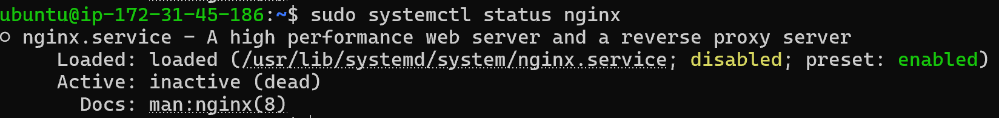

2. **啟動 Nginx** \
`sudo systemctl start nginx` \
結果失敗了 \
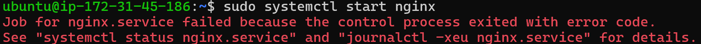

3. **再次檢查 Nginx status** \
發現錯誤 log `unexpected ";" in /etc/nginx/nginx.conf:8` \
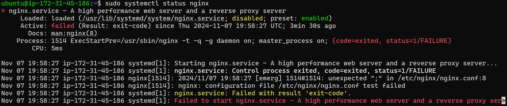

4. **nginx.conf 除錯** \
檢查 `nginx.conf` 第八行，發現多了一個分號 \
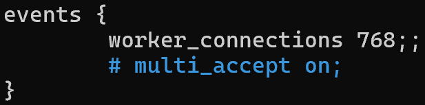 \
刪掉分號之後 start nginx，發現還是有 error，是有人佔用 port 80 \
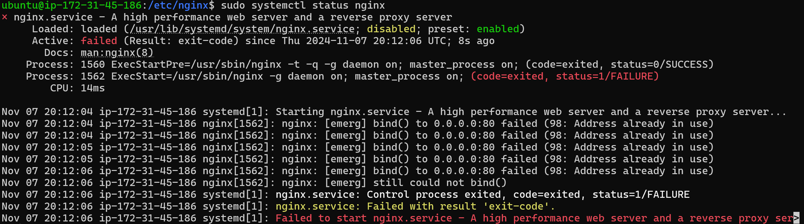

5. **檢查 port 80 使用狀況** \
用 `sudo lsof -i :80` 列出 port 80 有誰使用 \
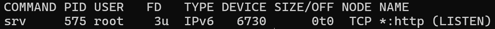
再用 `sudo kill 575` 刪掉占用的服務，便可以成功 start nginx

6. **檢查防火牆** \
雖然 nginx 已經成功啟動，但 `curl localhost` 仍然連線失敗，並顯示： \
`curl: (7) Failed to connect to localhost port 80 after 0 ms: Couldn't connect to server` \
因此檢查防火牆設定 `sudo iptables -L` \
發現 `INPUT` policy 預設 reject http request \
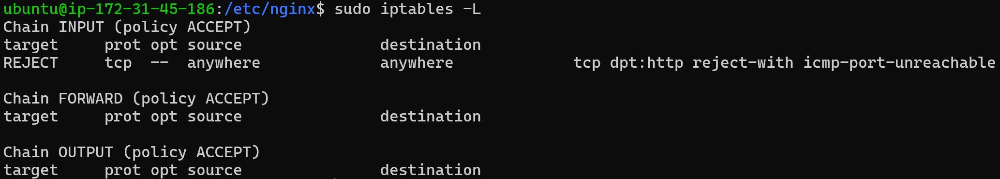
因此多加了這條指令 `sudo iptables -I INPUT -p tcp --dport 80 -j ACCEPT` \
來允許 TCP port 80 的連線

7. **檢查檔案權限** \
再次測試連線，發現變成 403 forbidden \
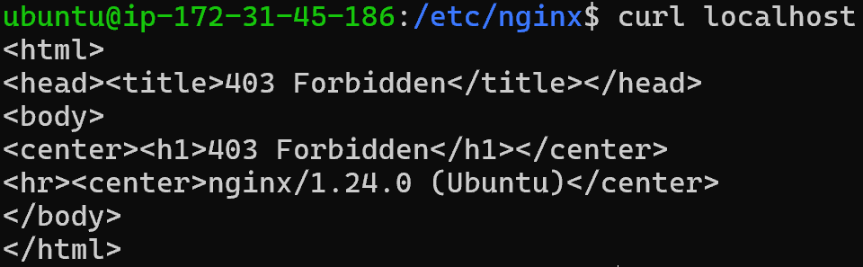
透過 `ls -la /var/myweb/index.html` 檢查權限 \
發現只有 root 有權限
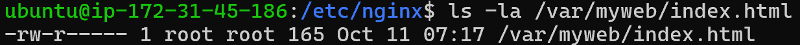
  - rw- 表示擁有者（root）可以 read 和 write
  - r-- 表示群組（root）只能 read
  - --- 表示其他人沒有任何權限 \
因此下了 `sudo chown www-data:www-data /var/myweb/index.html` 給 `www-data` 權限 \

之後再 `curl localhost` 就成功了！

## Reboot 處理
但是以上設定在 reboot 後，一切又會重來
1. disable 占用服務、enable nginx
  - `sudo systemctl disable srv`: disable 佔用 80 port 的 srv，讓他重新啟動的時候不會自動開啟
  - `sudo systemctl enable nginx`: 讓每次重新開啟的時候都會自動開 nginx

2. 處理防火牆的問題 \
去 /etc/iptables/ 裡面看 rules.v4 的檔案 \
發現他都是 reject tcp 80 port \
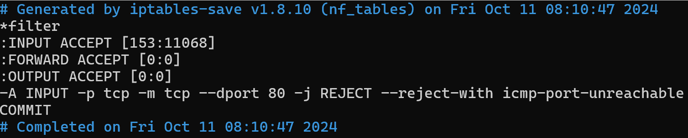
把 `-A INPUT -p tcp -m tcp --dport 80 -j REJECT --reject-with icmp-port-unreachable` \
改成 `-A INPUT -p tcp -m tcp --dport 80 -j ACCEPT`

如此一來便可以解決 Reboot 過後的問題

## Disk usage
1. 用 `df -h` 檢查誰的 usage 接近 100%
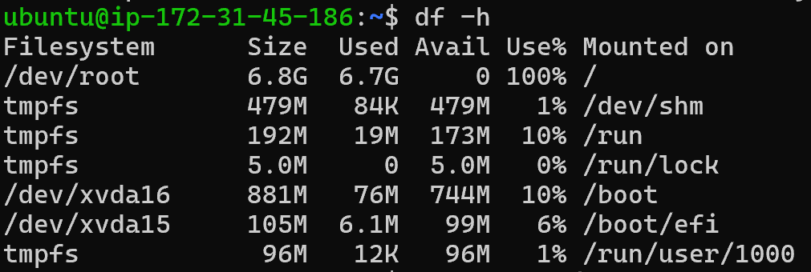

2. 透過 `sudo find / -type f -size +100M -ls` 找到大檔案
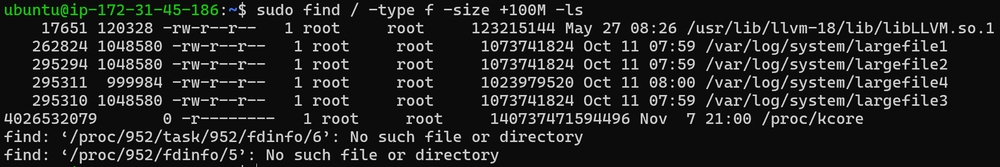

## 心得
我覺得這個 lab 很好玩 ~ 學到了很多沒有想到要檢查的東西，比如說 iptables，也沒有考慮到 Reboot 後一切都要重來，原本以為已經 debug 完了，不過也讓我知道要做到重啟後設定保持不變。除此之外，在過程中有發現記憶體已經快滿了，因此沒辦法寫東西進去，這讓我了解到要檢查記憶體容量。總之，這次的驗屍報告我學到很多！